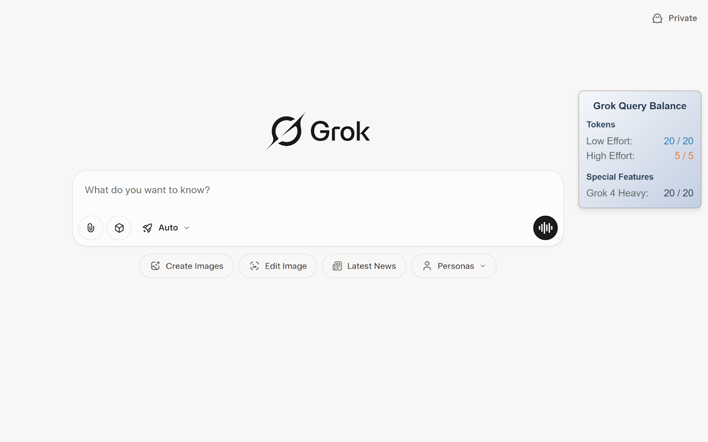

# 🌟 Grok Usage Watch – Rate Limit Tracker

> 🔎 即時顯示 Grok 剩餘對話與 Token 使用情況（支援 Grok 3 與 Grok 4）

---

## 📌 功能介紹

**Grok Usage Watch** 是一個輕量級瀏覽器擴充功能，可即時顯示你在 Grok 的剩餘對話次數與 Token 額度。

---

## ✨ 功能特色

* ✅ 即時查看 Grok 剩餘對話次數與 Token 額度（支援 Grok 3 + Grok 4）
* 🪙 付費用戶支援 Token 顯示
* 🔄 免費用戶維持 query-based 顯示
* 🎨 有風格且動畫平滑的浮動介面
* 🧲 完全可拖曳的位置設計
* ⚡ 每 5 秒自動更新一次
* 🧠 安裝後可立即在 [grok.com](https://grok.com) 運作，無需設定
* 🌍 相容於 **Chrome、Edge、Brave** 等 Chromium 核心瀏覽器

---

## 📸 截圖預覽

### 🔐 付費用戶 UI

---

### 🆓 免費用戶 UI

---

## 🛠 安裝方式

從 Chrome Web Store 安裝： [點此安裝](https://chrome.google.com/webstore/detail/bmpboaihdkpkjehbceegdmndkonlpdge)

---

## 🧩 專案檔案說明

* `manifest.json`：擴充功能設定與權限定義
* `content.js`：注入頁面的腳本，負責即時抓取並顯示剩餘對話次數
* `background.js`：點擊工具列圖示可直接開啟 grok.com

---

## 🔐 權限需求

* `"host_permissions": ["https://grok.com/*"]`

所有資料皆僅儲存在本地瀏覽器，不會上傳或分享。

---

## 📜 版本說明

此專案先前以「Grok Rate Checker」發佈，版本號最高至 **1.5**。
現在重新以 **Grok Usage Watch** 名稱上架，並以 **1.0.2** 為起始版本號。
未來版本號將依 Chrome Web Store 釋出進度遞增。

[更新紀錄](./CHANGELOG.md)

---

## 👨‍💻 作者資訊

作者：Joshua Wang
專為 Grok 重度使用者設計 — 無論你是開發者、研究員、資料分析師，還是每天瘋狂使用 Grok 的人。這個工具追求透明、流暢與極致 UX 🧠✨

---

## 📬 聯絡方式

有建議或想法嗎？
歡迎 [提交 issue](https://github.com/JoshuaWang2211/grok-usage-watch/issues)