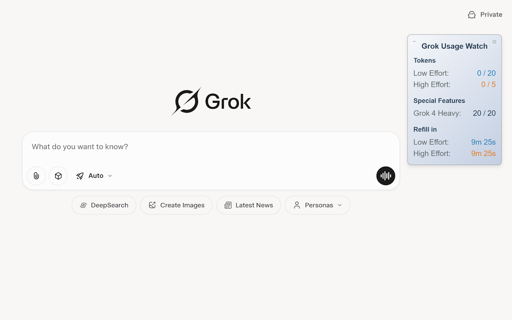
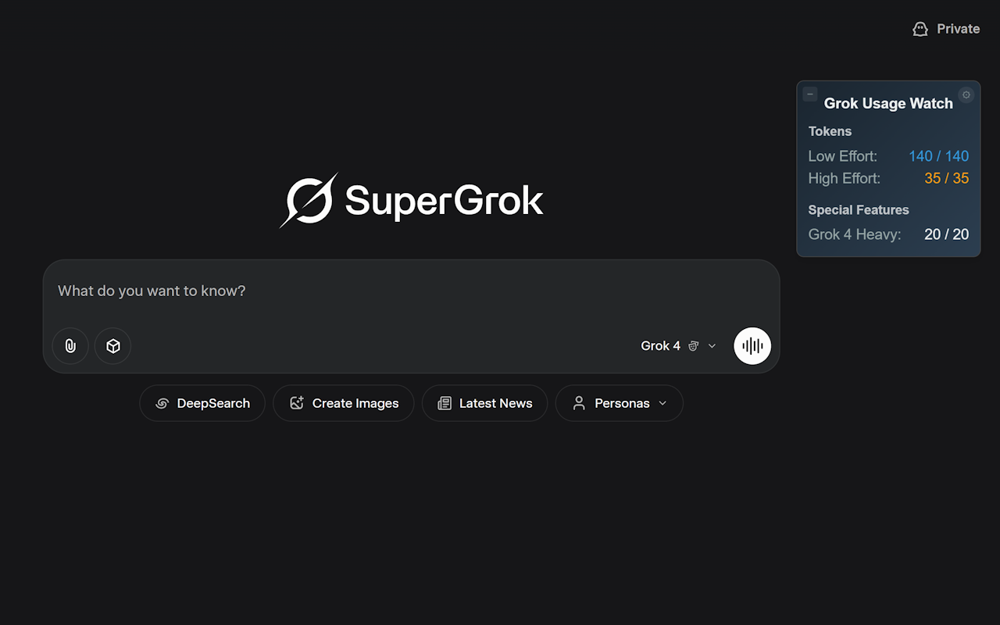

# 🌟 Grok Usage Watch – Rate Limit Tracker

🔎 即時顯示 Grok 使用量（支援 Grok 3 與 Grok 4）  

📘 [View in English](./README.md)

---

## 📌 功能介紹

**Grok Usage Watch** 是一款輕量級的瀏覽器擴充功能，能在 Grok.com 網站上即時顯示你的剩餘使用資源。 

支援 Grok 3、Grok 4 和 Grok 4 Heavy，透過簡潔、可拖曳的懸浮視窗，讓你隨時掌握使用狀況。

---

## ✨ 功能特色

* 即時用量追蹤
* 支援 Grok 免費與付費用戶
* 可拖曳的懸浮式介面
* 用量耗盡時會顯示補充倒數計時
* 支援深色／淺色模式切換

---

## 📸 截圖預覽

---

---

## 🛠 安裝方式

從 Chrome Web Store 安裝： [點此安裝](https://chrome.google.com/webstore/detail/bmpboaihdkpkjehbceegdmndkonlpdge)

---

## 🧩 專案檔案說明

* `manifest.json`：擴充功能設定與權限定義
* `content.js`：注入頁面的腳本，負責即時抓取並顯示剩餘額度
* `background.js`：點擊工具列圖示可直接開啟 grok.com

---

## 🔐 權限需求

* `"host_permissions": ["https://grok.com/*"]`

所有資料皆僅儲存在本地瀏覽器，不會上傳或分享。

---

## ⚠️ 使用須知

* 本擴充功能依賴 Grok.com 現行的公開 API。若未來 xAI 對其網站介面進行修改，部分功能可能會受影響或失效。

---

## 📜 版本說明

* 此專案先前以「Grok Rate Checker」發佈，版本號最高至 **1.5**。
* 現在重新以 **Grok Usage Watch** 名稱上架，並以 **1.0.2** 為起始版本號。
* 未來版本號將依 Chrome Web Store 釋出進度遞增。

[更新紀錄](./CHANGELOG.md)

---

## 👨‍💻 作者資訊

* 作者：Joshua Wang
* 本工具專為 Grok 重度使用者打造，無論你是開發者、研究員、資料分析師，或是每天頻繁使用 Grok 的一般用戶，都能享受到透明、流暢的使用體驗。

---

## 📬 聯絡方式

有建議或想法嗎？  
歡迎 [提交 issue](https://github.com/JoshuaWang2211/grok-usage-watch/issues)

---

## 📜 授權條款

本專案採用 MIT 授權條款。詳情請參見 [LICENSE](./LICENSE)。