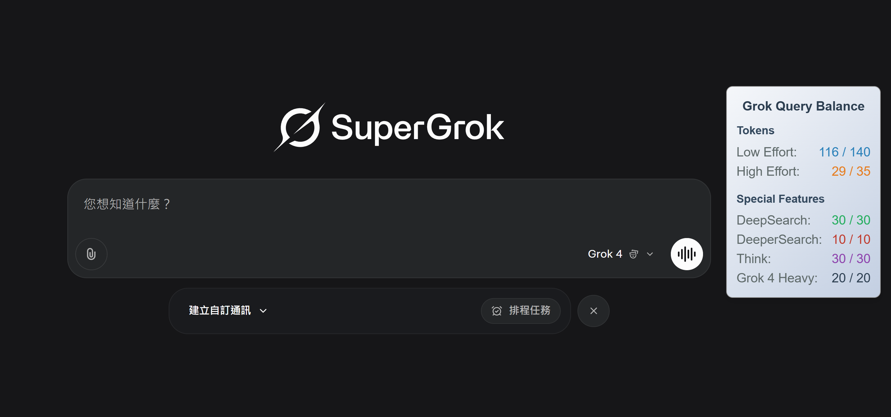

# 🌟 Vérificateur de Quotas Grok

> 🔎 Affiche en temps réel le solde des requêtes Grok (Default Chat, DeepSearch, DeeperSearch, Think)

---

## 📌 Qu'est-ce que c'est ?

**Grok Rate Checker** est une extension de navigateur légère qui affiche en temps réel votre **quota de requêtes Grok** — plus besoin de deviner combien il vous en reste !

🧠 Prend en charge :
- **Default Chat** (requêtes standard)
- **DeepSearch**
- **DeeperSearch**
- **Think** (mode raisonnement)

Affiche les limites restantes et totales dans une interface flottante élégante et déplaçable.

---

## ✨ Fonctionnalités

- ✅ Affichage en temps réel du quota de requêtes
- 🎨 Interface flottante animée et élégante
- 🧲 Entièrement déplaçable
- ⚡ Rafraîchissement automatique toutes les 5 secondes
- 🧠 Fonctionne instantanément sur [grok.com](https://grok.com)
- 🌍 Compatible avec **Chrome, Edge, Brave**, etc.

---

## 📸 Capture d'écran



---

## 🛠 Installation

1. Clonez ou téléchargez ce dépôt
2. Accédez à `chrome://extensions/`
3. Activez le **mode développeur**
4. Cliquez sur **« Charger l’extension non empaquetée »**
5. Sélectionnez le dossier du projet
6. Allez sur [https://grok.com](https://grok.com) — et c’est parti ! 🎉

---

## 🧩 Fichiers

- `manifest.json` – Configuration de l'extension
- `content.js` – Script injecté qui affiche les limites en temps réel

---

## 📤 API utilisée

```
POST https://grok.com/rest/rate-limits
```

Exemple de requête :
```json
{
  "requestKind": "DEFAULT",
  "modelName": "grok-3"
}
```

Réponse attendue :
```json
{
  "remainingQueries": 42,
  "totalQueries": 50
}
```

---

## 🔐 Permissions

- `"activeTab"`
- `"storage"`
- `"host_permissions": ["https://grok.com/*"]`

Aucune donnée n’est stockée ou partagée en dehors de votre navigateur local.

---

## 👨‍💻 Auteur
Créé par Joshua Wang

Conçu pour les utilisateurs intensifs de Grok — développeurs, chercheurs, analystes ou passionnés d’IA. Fait pour une UX fluide et transparente. 🧠✨

## 📜 Licence
Sous licence MIT — voir [LICENSE](../LICENSE).

## 📬 Contact
Des suggestions ou retours ?  
[Ouvrez une issue](https://github.com/JoshuaWang2211/grok-rate-checker/issues)  
ou contactez-moi via X (anciennement Twitter) : [@JoshuaWang2211](https://x.com/JoshuaWang2211)
