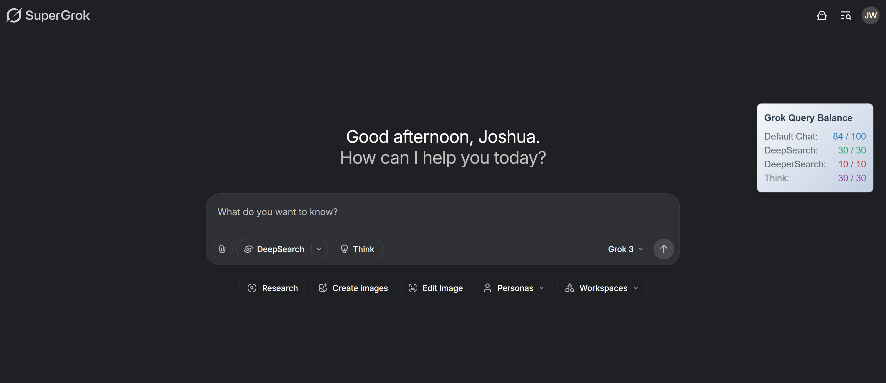

# 🌟 Grok Rate Checker

> 🔎 Real-time Grok Query Balance viewer (Default Chat, DeepSearch, DeeperSearch, Think)

---

🌐 Available Translations:  
[繁體中文](./i18n/README.zh-tw.md)｜[简体中文](./i18n/README.zh-cn.md)｜[日本語](./i18n/README.ja.md)｜[한국어](./i18n/README.ko.md)｜[Français](./i18n/README.fr.md)｜[Español](./i18n/README.es.md)｜[Deutsch](./i18n/README.de.md)

---

## 📌 What is this?

**Grok Rate Checker** is a lightweight browser extension that displays your **Grok Query Balance** in real time — no guessing required.

🧠 Tracks usage of:
- **Default Chat** (Standard Queries)
- **DeepSearch**
- **DeeperSearch**
- **Think** (Reasoning Mode)

Displays remaining and total limits in a draggable, elegant floating UI.

---

## ✨ Features

- ✅ Realtime Grok query balance viewer
- 🎨 Stylish, animated floating UI
- 🧲 Fully draggable interface
- ⚡ Refreshes automatically every 5 seconds
- 🧠 Works instantly on [grok.com](https://grok.com) with no config needed
- 🌍 Compatible with **Chrome, Edge, Brave**, and other Chromium-based browsers
---

## 📸 Screenshot



---

## 🛠 Installation

1. Clone or download this repository
2. Go to `chrome://extensions/`
3. Enable **Developer Mode**
4. Click **"Load unpacked"**
5. Select this project's folder
6. Navigate to [https://grok.com](https://grok.com) — and you're good to go! 🎉

---

## 🧩 Files

- `manifest.json` – Extension setup and permissions
- `content.js` – Injected script that fetches & displays the rate limits in real time

---

## 📤 API Used

This extension queries the following endpoint:

```
POST https://grok.com/rest/rate-limits
```

**Sample request body:**
```json
{
  "requestKind": "DEFAULT",
  "modelName": "grok-3"
}
```

**Expected response:**
```json
{
  "remainingQueries": 42,
  "totalQueries": 50
}
```

---

## 🔐 Permissions

- `"activeTab"`
- `"storage"`
- `"host_permissions": ["https://grok.com/*"]`

No data is stored or shared outside your local browser.

---

## 👨‍💻 Author
Created by Joshua Wang

Built for Grok heavy users — whether you're a developer, researcher, analyst, or just someone who constantly pushes Grok to its limits. Designed with transparency and smooth UX in mind. 🧠✨

## 📜 License
This project is licensed under the MIT License — see [LICENSE](./LICENSE) for details.

## 📬 Contact
Have feedback or suggestions?  
Feel free to [open an issue](https://github.com/JoshuaWang2211/grok-rate-checker/issues)  
or reach out via X (formerly Twitter): [@JoshuaWang2211](https://x.com/JoshuaWang2211)
